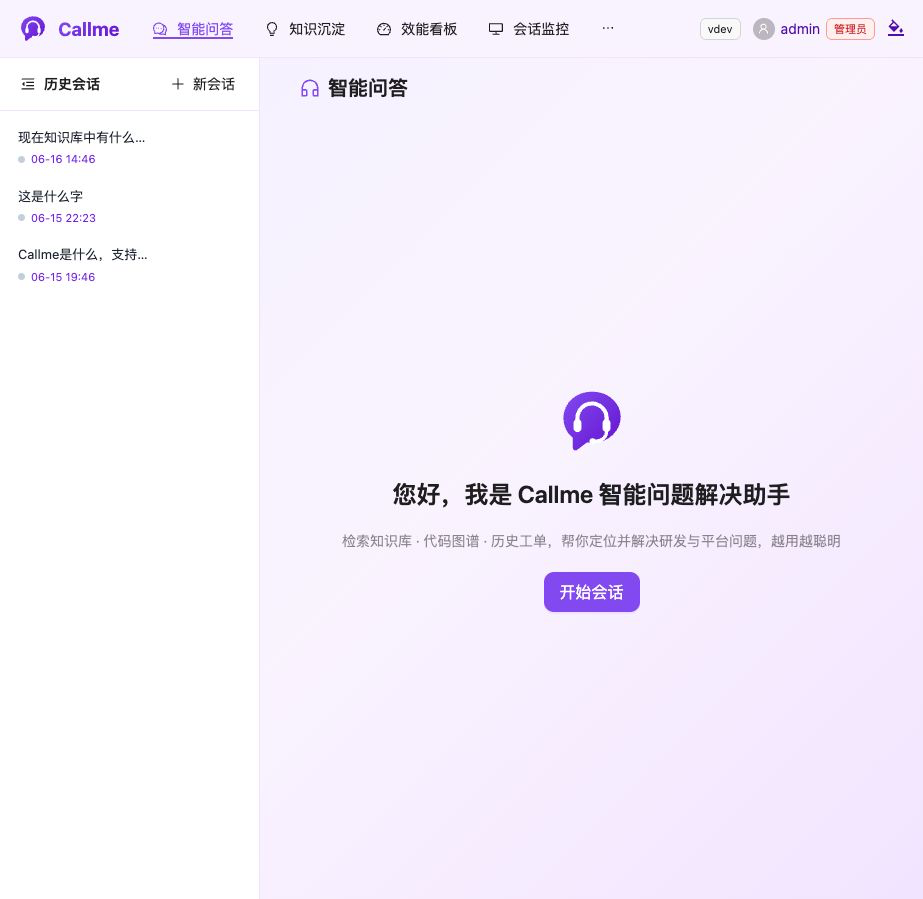
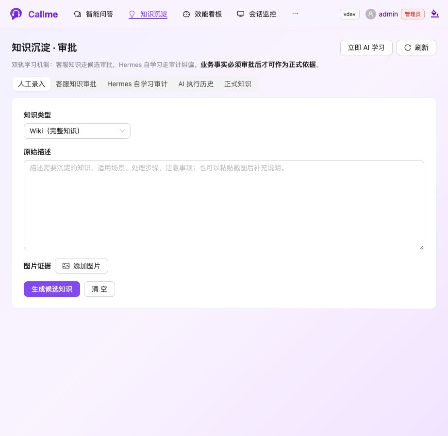
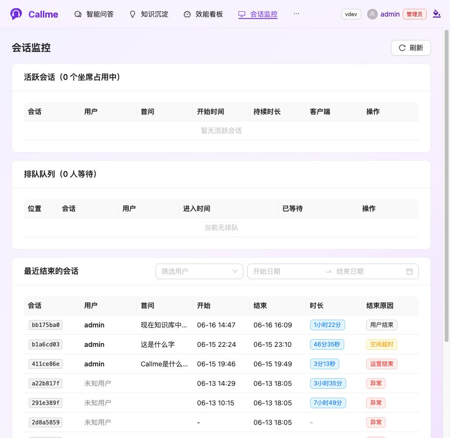
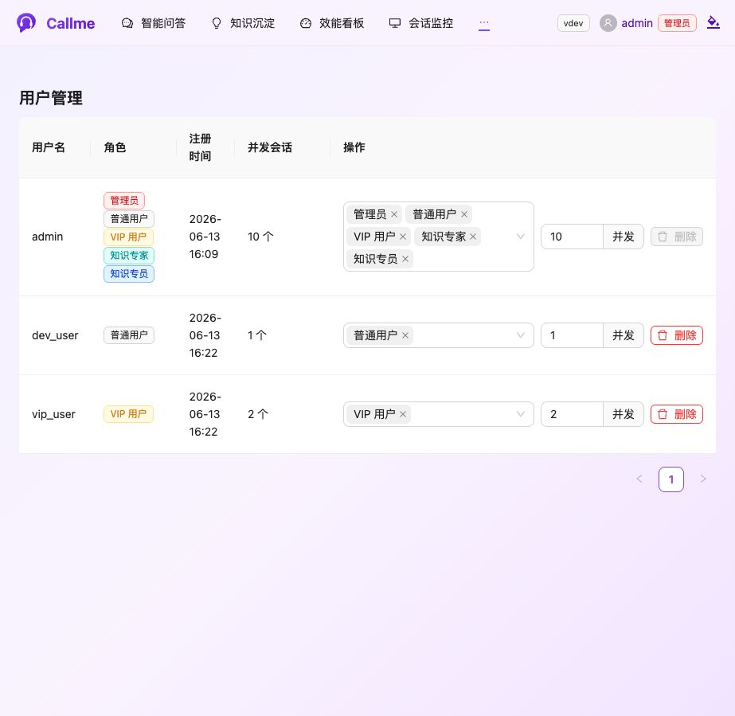
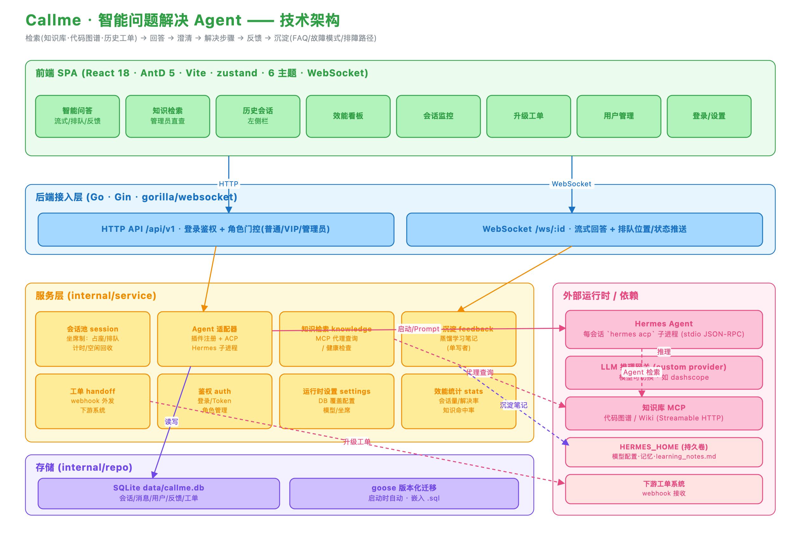

# Callme

Callme 是面向研发、平台和技术支持团队的智能问题解决 Agent 平台。

它不是传统意义上的客服机器人，而是一个围绕“定位问题、调用知识、给出解决步骤、沉淀经验”的工程协作入口。Callme 期望把散落在代码图谱、Wiki、历史会话、工单和专家经验里的知识串起来，让用户在遇到技术问题时能更快得到可执行的诊断与处理建议。

## 项目愿景

Callme 的目标是成为企业内部的“智能问题解决层”：

- 面向真实技术问题，而不是只做 FAQ 匹配。
- 通过 Agent Runtime 接入不同 Agent 类型，例如 Hermes、OpenCode 或 Mock Agent。
- 通过 MCP 接入知识库、代码图谱、Wiki 图谱等外部知识源。
- 通过用户反馈、纠错和历史工单沉淀组织经验。
- 通过坐席制并发控制，让 Agent 资源像人工坐席一样可管理、可排队、可监控。

核心闭环：

```text
用户提问
  -> Agent 理解问题
  -> 检索知识库 / 代码图谱 / Wiki / 历史材料
  -> 生成带引用的回答
  -> 必要时继续追问澄清
  -> 给出可执行排障步骤
  -> 用户反馈 / 转人工
  -> 沉淀为后续可复用知识
```

## 核心功能

| 能力 | 说明 |
| :-- | :-- |
| 智能问答 | 基于常驻 Agent 会话提供多轮问答、流式输出、执行过程展示 |
| Agent Runtime | 支持多 Agent 类型配置，当前包含 Hermes、OpenCode、Mock Agent |
| 模型配置 | 管理员在设置页维护 Agent 类型、CLI 路径、模型、API Base URL、Token、系统提示词 |
| 知识库接入 | 通过 MCP 接入代码图谱、Wiki 图谱等知识源，回答中展示引用来源 |
| 图片输入 | 支持选择、粘贴、拖拽图片并通过 ACP 多模态内容块转发给 Agent |
| 历史会话 | 支持历史查看、删除、继续问答；继续会话优先使用 Agent 原生 resume，不注入历史 prompt |
| 坐席与排队 | 通过坐席池限制最大并发会话，超出后进入 FIFO 队列 |
| 用户与权限 | 支持普通用户、VIP、管理员；管理员可管理用户、配置系统、查看运营数据 |
| 转人工 | 用户可将当前会话升级为人工工单，并携带会话上下文 |
| 反馈沉淀 | 点赞、点踩、纠错进入反馈闭环，沉淀为候选知识并经人工审批后发布 |
| 效能看板 | 展示会话量、知识命中、满意度、转人工等运营指标 |
| 发布升级 | 提供 Linux 发布包、一键启停、systemd 模板、一键升级与备份保留策略 |

> 图片输入依赖底层 Agent 与模型的多模态能力。如果 Agent 的 ACP 实现暂不接受 image content block，会返回协议参数错误；此时需要切换支持图片的 Agent/模型，或在适配器中增加对应 Agent 的图片传输格式。

## 界面预览

### 智能问答

面向研发与平台问题的一站式问答入口，支持历史会话、Agent 回答、图片输入、停止生成、继续追问和转人工。



### 知识沉淀

支持人工录入、AI 生成候选知识、客服知识审批、Hermes 自学习审计和正式知识管理，让经验沉淀进入可控流程。



### 会话监控

管理员可以查看活跃会话、排队队列和最近结束的会话，结合用户、时间范围、会话时长和结束原因定位资源占用与服务质量。



### 用户与角色

支持多角色用户、并发会话额度和角色切换，普通用户、VIP、知识专员、知识专家和管理员可以拥有不同功能边界。



## 技术架构



```text
Browser (React + AntD)
  | HTTP / WebSocket
  v
Go Server (Gin)
  |-- auth       登录、Token、角色权限
  |-- session    坐席池、排队、会话生命周期、WebSocket 推送
  |-- agent      Agent 注册中心、Runtime Spec、ACP 适配层
  |-- feedback   用户反馈、候选知识审批、Hermes 自学习审计
  |-- handoff    转人工工单
  |-- stats      看板统计
  |-- settings   运行时设置，保存到 SQLite
  v
SQLite (data/callme.db)

Agent Runtime
  |-- Hermes ACP
  |-- OpenCode ACP
  |-- Mock Agent

MCP Knowledge Sources
  |-- code-graph
  |-- wiki-graph
  |-- enterprise knowledge MCP
```

数据库迁移使用 `goose`，迁移文件嵌入在后端二进制中。服务启动时会自动执行未应用的迁移。

## 目录结构

```text
cmd/server                 后端服务入口
cmd/mock-kb                本地 mock MCP 知识库
configs/config.yaml.example 服务启动配置模板
internal/api               HTTP API
internal/repo              SQLite 访问与 goose 迁移
internal/service           业务服务
internal/service/agent     Agent Runtime 抽象与插件
internal/ws                WebSocket 处理
scripts/                   启停、打包、升级脚本
tools/wsprobe              WebSocket 冒烟工具
web/                       React 前端
```

## 快速开始

### 依赖

- Go 1.25+
- Node.js 20+
- Hermes CLI 或其他可用 Agent CLI
- 如使用 Hermes MCP，Hermes 运行环境需要安装 `mcp` Python SDK：

```bash
"$(head -1 $(which hermes) | sed 's/^#!//')" -m pip install mcp
```

### 本地启动

```bash
cp configs/config.yaml.example configs/config.yaml
make build
make run
```

默认服务地址：

```text
http://localhost:8090
```

首次注册的账号会成为管理员。登录后进入“设置”页配置 Agent 类型、模型、API 地址、Token、系统提示词和坐席容量。这些运行时设置会保存到 SQLite，不建议写入 `configs/config.yaml`。

### 前端开发模式

```bash
make dev-web
```

Vite 默认监听 `:5180`，并代理到后端 `:8090`。

### 本地 mock 知识库

```bash
make mock-kb
```

mock MCP 监听：

```text
http://127.0.0.1:9100/code/mcp
http://127.0.0.1:9100/wiki/mcp
```

如需同时启动 mock 知识库和后端：

```bash
make run-all
```

## 配置说明

`configs/config.yaml` 只保存服务启动所需的基础配置，例如端口、数据库路径、Agent 工作目录、日志路径。

模型、API Token、系统提示词、坐席容量等运行时配置由管理员在页面设置，并保存到 SQLite。这样可以避免把敏感信息放进配置文件或发布包。

重要路径：

```text
data/callme.db            SQLite 数据库
data/hermes-home          Hermes 持久化目录，可能包含模型配置、记忆和 Token
data/workdir              会话工作目录
logs/callme.log           服务日志
```

内网模型网关、长回答或多工具调用场景下，Agent 单轮回答可能超过默认时长。可在 `configs/config.yaml` 中调整：

```yaml
agent:
  prompt_timeout: 30m # 负数表示不主动超时
```

## Agent 与 MCP

### Agent 类型

Callme 通过 Agent Runtime 抽象管理不同 Agent 类型。设置页中的 Agent 类型来自后端注册表。当前主要类型：

- `hermes`：通过 ACP 协议接入 Hermes。
- `open_code`：通过 ACP 方式接入 OpenCode。
- `mock`：本地测试用。

前端展示时使用平台名称“Callme 助手”，同时在回复标签中展示真实 Agent 类型和模型，例如：

```text
Hermes · glm-5
OpenCode · <model>
```

### MCP 知识源

当前知识库 MCP 配置优先通过 Agent 自身配置管理。以 Hermes 为例，MCP 服务写入 Hermes 本地配置，由 Agent 在会话中自主调用。

本地 mock 知识源只用于开发联调。生产环境请接入企业内部真实 MCP 服务。

## 历史会话与上下文

Callme 不会粗暴地把历史消息拼接进新 prompt。

继续历史会话时优先使用底层 Agent 原生 resume 能力；如果 Agent 不支持原生恢复，应谨慎处理，避免把大量历史上下文直接塞进 prompt 导致：

- 上下文过大、成本上升。
- 历史信息误导当前问题。
- 敏感信息被不必要地扩散给 Agent。

## 图片输入

前端支持：

- 点击图片按钮选择图片。
- 粘贴剪贴板图片。
- 拖拽图片到输入区。

限制：

- 最多 4 张。
- 单张不超过 10MB。
- 仅支持图片 MIME 类型。

后端会校验图片数量、类型和大小，并通过 ACP image content block 传递给 Agent。图片输入是否真正可用，取决于当前 Agent 与模型是否支持多模态。

## 开发者指导

### 常用命令

```bash
make build          # 构建前端与后端
make build-server   # 构建后端和 mock-kb
make build-web      # 构建前端
make test           # 后端测试
make run            # 构建并运行后端
make run-all        # mock-kb + 后端
make dev-web        # 前端开发模式
make package        # Linux amd64 发布包
make package-arm64  # Linux arm64 发布包
```

WebSocket 冒烟：

```bash
go run ./tools/wsprobe -session <session-id> -msg "问题"
```

### 新增数据库变更

数据库迁移文件放在：

```text
internal/repo/migrations/
```

规则：

- 新增迁移使用递增编号，例如 `00002_add_xxx.sql`。
- 文件包含 `-- +goose Up` 与 `-- +goose Down`。
- 已发布迁移不要修改，只新增迁移。
- 迁移会嵌入后端二进制，服务启动时自动执行。

### 新增 Agent 类型

新增 Agent 时建议：

1. 在 `internal/service/agent/plugins/<agent>` 下实现适配器。
2. 复用 `agent.Adapter` 接口，保持 `StartSession -> Prompt -> StopSession` 生命周期。
3. 如果是 ACP Agent，优先复用 ACP 基础适配器。
4. 在插件注册表中注册 Agent 类型、显示名和默认 CLI 路径。
5. 补充设置页显示与健康检查。
6. 明确是否支持原生 resume、图片、多模态、MCP。

### Agent MCP 知识源

知识源当前由具体 Agent 的本地 MCP 配置管理。以 Hermes 为例，建议约定：

- `name` 使用稳定机器名，如 `code-graph`、`wiki-graph`。
- 鉴权信息不要提交到仓库。
- 生产环境使用内网地址或服务发现，避免把本地 mock 地址写死进发布配置。

## 发布与升级

### 打包

```bash
make package
```

产物：

```text
dist/callme-<version>-linux-amd64.tar.gz
```

发布包包含：

- `callme-server`
- `web/dist`
- `configs/config.yaml.example`
- `start.sh`
- `stop.sh`
- `status.sh`
- `upgrade.sh`
- `callme.service`
- `INSTALL.md`
- `LICENSE`

发布包不包含：

- `data/`
- `logs/`
- `configs/config.yaml`
- mock-kb
- 本机 Token 或数据库

### Linux 启停

```bash
./start.sh
./status.sh
./stop.sh
```

### 一键升级

在现有安装目录执行：

```bash
./upgrade.sh /tmp/callme-新版本-linux-amd64.tar.gz
```

升级脚本会：

- 停止当前服务。
- 备份 `callme-server`、`web/dist`、`configs/config.yaml`、`data/` 等关键内容。
- 覆盖程序文件和前端静态资源。
- 保留现有 `configs/config.yaml`。
- 写入新版本 `configs/config.yaml.example` 和 `configs/config.yaml.new`。
- 最多保留最近 3 份备份。
- 若升级前服务在运行，则升级后自动启动。

使用 systemd 且服务名不是 `callme` 时：

```bash
CALLME_SYSTEMD_SERVICE=your-service ./upgrade.sh /tmp/callme-新版本-linux-amd64.tar.gz
```

## 提交与安全约定

不要提交：

```text
bin/
dist/
web/dist/
web/node_modules/
data/
logs/
configs/config.yaml
configs/config.yaml.new
backups/
.upgrade-tmp-*
```

这些内容可能包含构建产物、数据库、Token、Hermes 记忆或本机配置。发布产物应作为 Release artifact 管理，不进入源码提交。

提交前建议执行：

```bash
go test ./...
npm run build --prefix web
```

## 仍需关注

- 图片输入需要逐个 Agent 验证协议格式与模型能力。
- Hermes / OpenCode 的原生 resume 行为需要继续回归测试。
- 生产知识库 MCP 的鉴权、超时、重试、健康检查策略需要和企业内网环境对齐。
- 内网部署如出现 Agent 回答中途停止，优先检查 `agent.prompt_timeout`、反向代理 WebSocket 超时和模型网关超时。
- `data/hermes-home` 可能包含敏感信息，备份和升级目录需要配置合适的文件权限。
- 大型前端 chunk 目前有 Vite 警告，后续可按页面拆包优化。

## License

Callme is licensed under the Apache License, Version 2.0. See [LICENSE](./LICENSE) for details.
