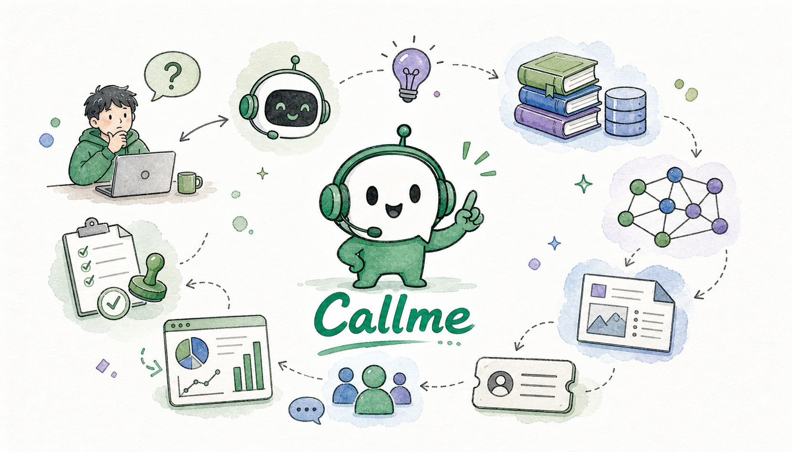
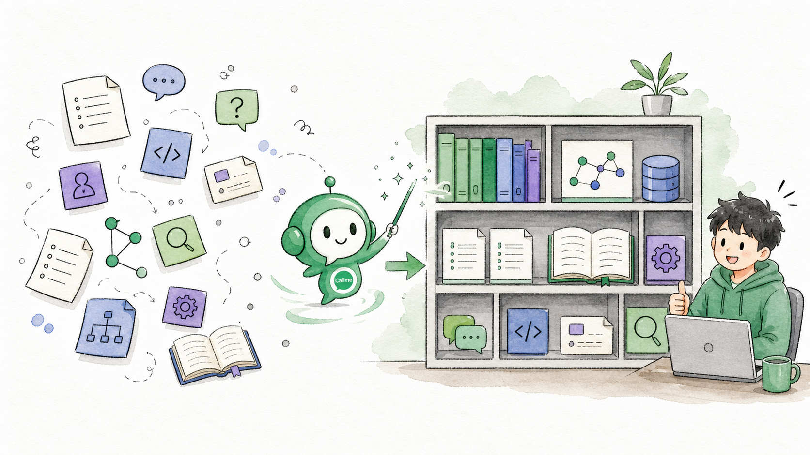
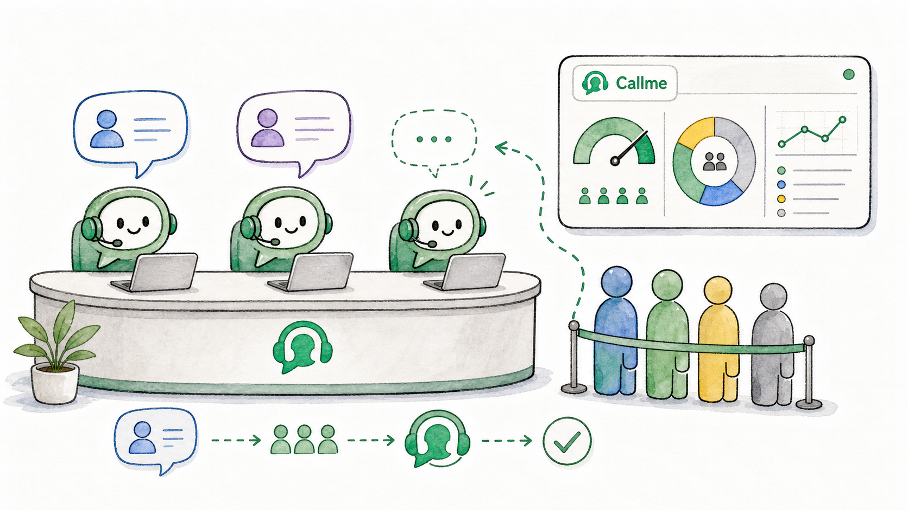
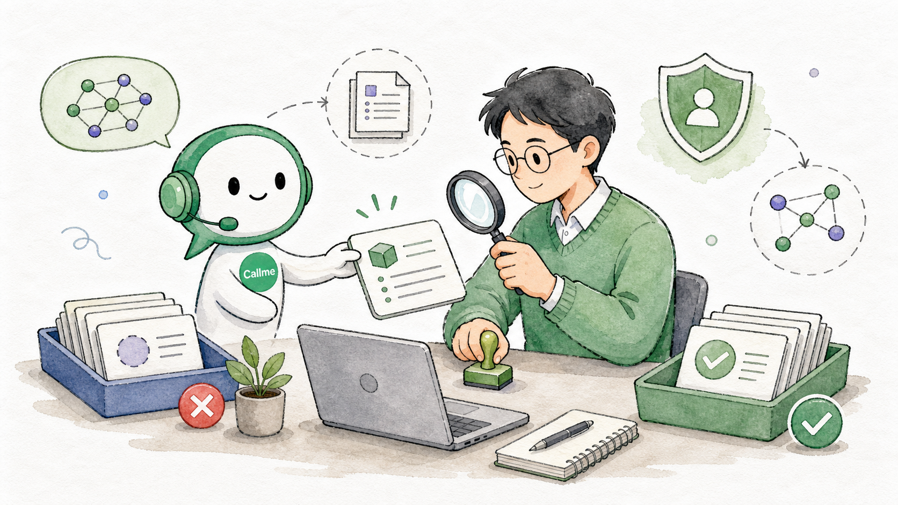
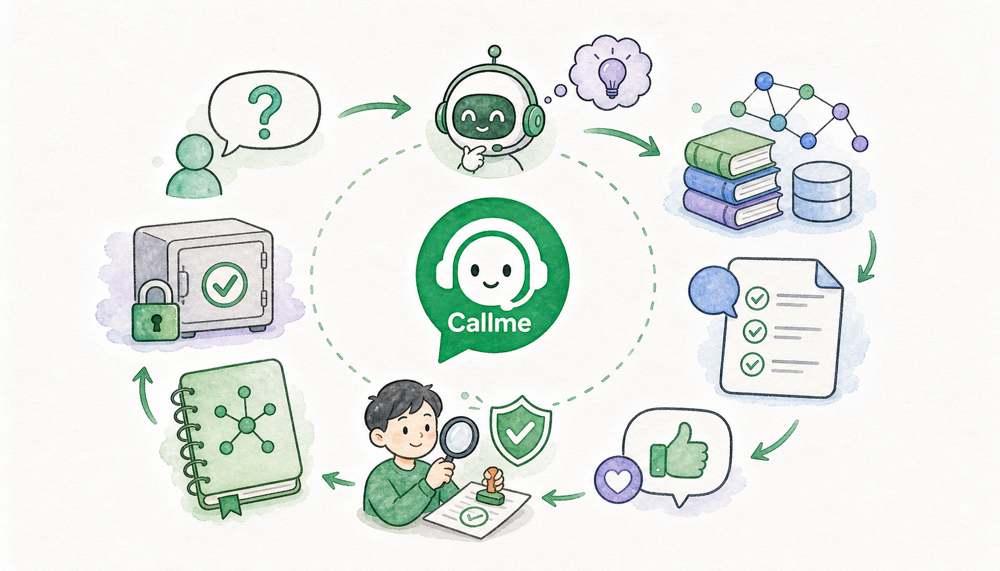

# Callme：把 AI Agent 放进企业技术支持流程里

很多团队并不缺知识，缺的是把知识及时用起来的能力。

当用户问“服务启动失败怎么办”时，真正有用的答案往往不只来自一段文档，而是来自部署经验、历史工单、代码线索、配置说明、监控现象和专家判断的组合。Callme 想做的，就是把这些分散信息和 AI Agent 连接起来，形成一个面向企业内部技术问题的智能解决入口。

Callme 不是一个单纯的聊天机器人。它更像一个“智能问题解决层”：用户可以提问，Agent 可以检索和分析，系统可以管理会话和排队，知识可以被沉淀和审批，管理员也能看到整体使用情况。

## 为什么需要 Callme

企业内部技术支持常见几个问题：

- 知识分散在文档、Wiki、代码、工单和聊天记录里。
- 用户的问题很短，但定位问题需要上下文。
- 高频问题反复消耗专家时间。
- AI 自动学习如果缺少审核，可能把错误经验固化。
- Agent 服务需要资源控制和运营监控。

Callme 的目标不是替代所有系统，而是把这些系统和流程连接起来，让技术问题从“到处找人问”变成“先进入一个可治理的智能入口”。

## 核心思路

### 1. Agent 可以替换，平台能力要沉淀

不同团队可能使用不同 Agent、模型和知识服务。Callme 不希望强绑定某一种 Agent，而是把底层 Agent 看成可替换的运行时能力。

平台负责用户、权限、会话、排队、监控、知识沉淀和配置管理；Agent 负责理解问题、调用工具、检索知识和生成回答。

这样，即使后续切换 Agent 类型，上层的平台能力仍然可以复用。

### 2. 像管理人工坐席一样管理 Agent

Agent 会话、工具调用和模型服务都有成本，不能无限拉起。

Callme 引入了“智能坐席”的概念：系统可以限制最大并发会话，超过上限后进入排队。不同用户也可以拥有不同并发额度，例如普通用户、VIP 和管理员可以有不同资源上限。

这让 Agent 服务从一个简单工具，变成可以被运营和管理的内部服务。

### 3. 知识沉淀必须先候选、再审批

AI 很擅长总结，但不代表总结出来的内容都应该直接进入正式知识库。

Callme 将用户反馈、历史会话挖掘、人工录入和 AI 整理的内容先放入候选知识池。候选知识可以被查看、编辑、补充或拒绝，只有经过知识专家或管理员审批后，才会成为正式知识。

核心原则很简单：发现不等于采用，AI 可以提出建议，但业务事实必须经过人工确认。

### 4. 把 Agent 自学习纳入审计

一些 Agent 会生成自己的技能、记忆或长期上下文资产。能力很强，但如果完全不可见，也会带来治理风险。

Callme 将这类内容视为 Agent Runtime 资产，提供查看、修改、保留、删除和 AI 辅助修订能力。底层 Agent 可以学习，但学习结果需要进入平台治理范围。

## 特色功能

### 智能问答

用户可以像咨询技术支持一样提问。Callme 支持多轮对话、流式回答、历史会话、继续追问、停止当前回答和转人工。

对于复杂问题，Agent 可以结合知识源进行分析，而不是只依赖模型自身记忆。

### 多套 Agent 配置

管理员可以维护多套 Agent 和模型配置，并快速切换。模型网关变化、Agent 类型升级、测试模型验证，都不需要频繁修改部署配置。

### 图片输入

技术支持经常离不开截图。Callme 支持上传、粘贴和拖拽图片，把报错截图、监控截图、页面异常等作为问题上下文交给支持多模态的 Agent 处理。

### 知识沉淀

知识沉淀被拆成几个清晰环节：人工录入、AI 挖掘、候选审批、正式知识、Agent 自学习审计。这样既能利用 AI 提效，又能保留人工审核。

### 多角色协作

Callme 支持普通用户、VIP、知识专员、知识专家和管理员等角色。知识专员可以录入和维护候选知识，知识专家和管理员负责审批，管理员还可以管理用户、配置和运营数据。

### 会话监控与效能看板

管理员可以看到活跃会话、排队队列、用户信息、会话时长和历史记录，也可以通过看板了解会话量、知识命中、满意度和转人工情况。

## Callme 和普通聊天机器人的区别

普通聊天机器人通常关注“生成回答”，Callme 更关注“解决问题”。

它不仅关心回答内容，也关心会话是否接入、资源是否足够、是否需要转人工、回答是否有效、能否沉淀为知识、知识是否经过审批，以及后续能否被复用。

换句话说，Callme 不是把 AI 放到一个聊天框里，而是把 AI 放进企业技术支持的真实流程里。

## 项目价值

对用户来说，Callme 降低了寻找答案的门槛。用户不必先判断该查哪个系统、找哪个人，只要描述问题，就可以获得初步诊断和处理建议。

对技术支持团队来说，Callme 可以减少重复答疑，把有效经验沉淀下来。需要人工接手时，也能带着更完整的上下文进入处理。

对知识负责人来说，Callme 提供了一个可控的知识生产流程。AI 负责辅助发现和整理，人负责判断和发布。

对管理员来说，Callme 让 Agent 服务变得可观察、可管理、可运营。

对企业来说，Callme 提供了一条务实的 Agent 落地路径：先连接已有知识和 Agent 能力，再逐步建立反馈、沉淀、审批和运营闭环。

## 适合哪些场景

Callme 适合这些场景：

- 内部研发支持
- 平台工程答疑
- 运维排障入口
- 私有云或中台产品支持
- 企业内部工具支持
- 研发知识库问答
- 历史工单经验复用

只要一个团队存在大量重复技术问题，并且知识分散在多个系统里，Callme 这类平台就有发挥空间。

## 下一步计划

Callme 仍在持续演进，接下来会重点完善几个方向：

- 更通用的知识源接入能力，让不同 MCP、Wiki、代码图谱和企业知识服务更容易被纳入。
- 更完善的 Agent Runtime 支持，让更多 Agent 类型可以平滑接入和切换。
- 更强的知识治理能力，包括知识版本、冲突检查、来源追溯和回滚。
- 更自然的知识录入体验，让知识专员可以用自然语言和图片快速生成候选知识。
- 更完整的运营指标，帮助团队理解哪些问题高频、哪些知识有效、哪些场景仍需人工支持。
- 更稳健的部署和测试体系，让 Callme 更适合企业内网长期运行。

## 结语

Agent 真正进入企业，不只是多一个聊天入口。

它需要和权限、知识、流程、资源、监控、反馈一起工作。Callme 的尝试，是把 AI Agent 放到企业技术支持的真实流程中：让它能提效，也能被管理；能学习，也能被审计；能自动化，也保留人工判断。

这就是 Callme 想成为的东西：企业内部面向技术问题的智能问题解决层。
